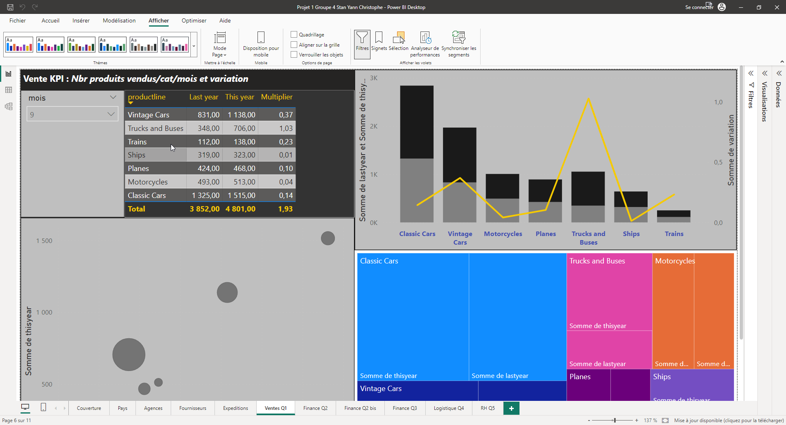
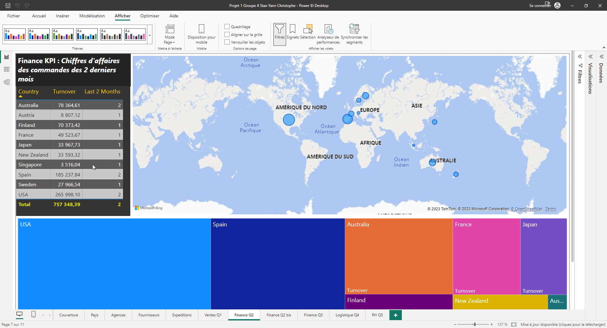
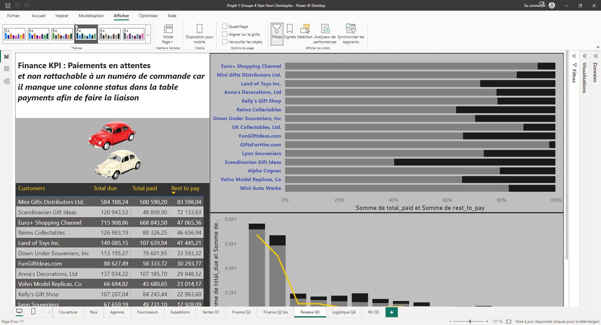
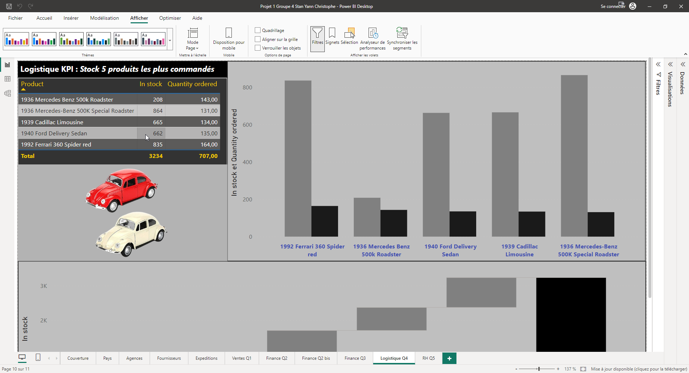
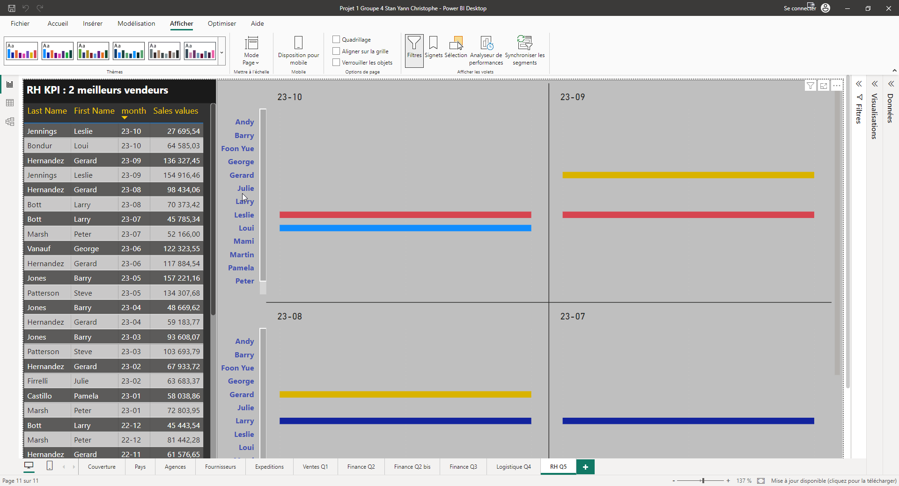
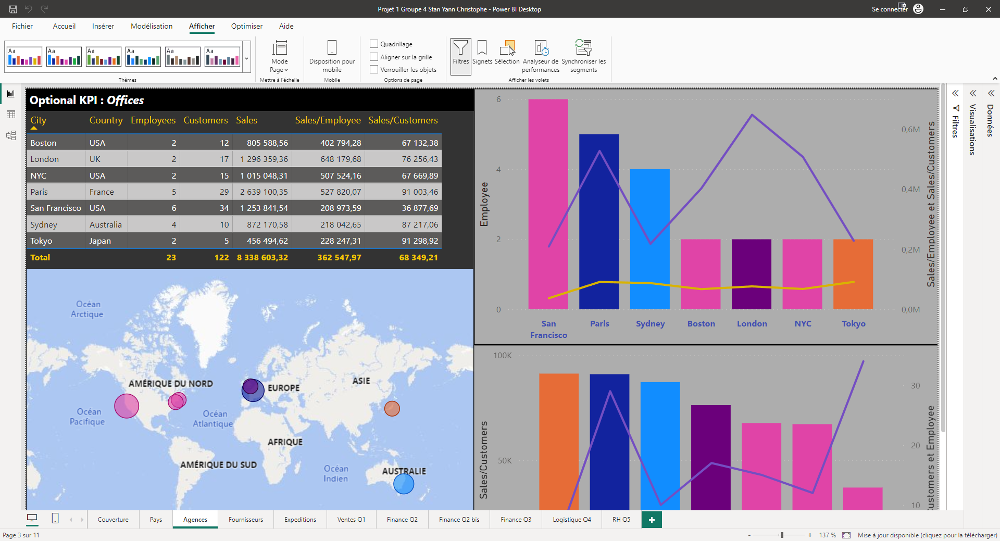
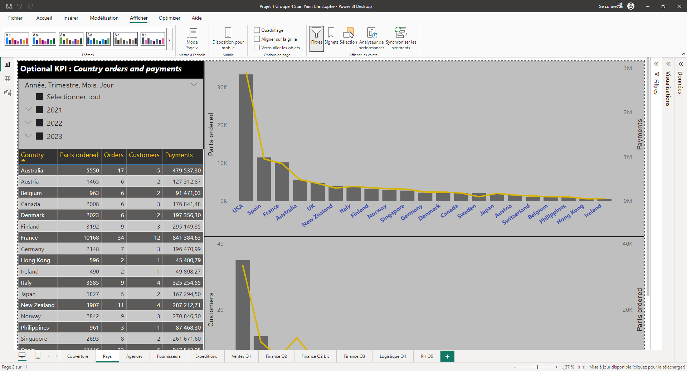
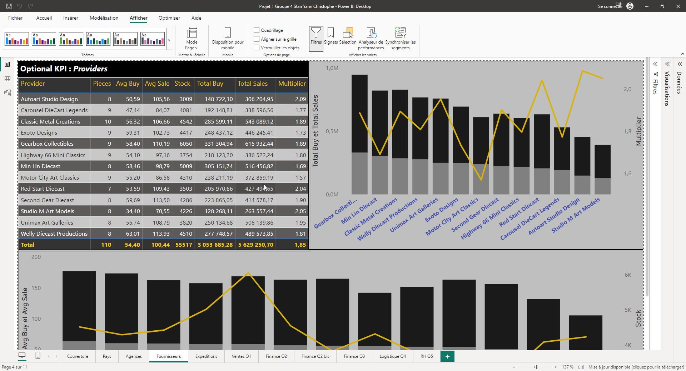
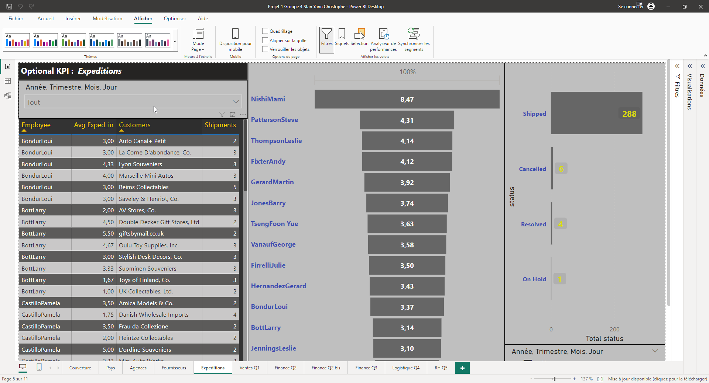

# Projet 1 - SQL & POWER BI - Toys & Models

[TOC]

<div style="page-break-after: always"></div>

## KPIs obligatoires

### Ventes

#### Nombre de produits vendus par catégorie et par mois, avec comparaison et taux de variation par rapport au même mois de l'année précédente.



```sql
-- Ventes : 
-- Nombre de produits vendus par catégorie et par mois, avec comparaison et taux de variation par rapport au même mois de l'année précédente.

select
	month(orderdate) as mois, -- Mois de la date de commande
	productline, -- Ligne de produit
	-- Calcul de la quantité commandée en fonction de l'année précédente 'lastyear' et l'année en cours 'thisyear'
	-- Utilisation de CASE WHEN pour filtrer les données en fonction de l'année de la commande
	-- Le taux de variation 'variation' est calculé en soustrayant 
	-- les ventes de l'année en cours de celles de l'année précédente, 
	-- puis en divisant par les ventes de l'année précédente. 
	-- On obtient une indication du taux de croissance ou de décroissance par rapport à l'année précédente.
	sum(case when year(orderdate)= year(now())-1 then (quantityordered) end) lastyear,
	sum(case when year(orderdate)= year(now()) then (quantityordered) end) thisyear,
	(
	sum(case when year(orderdate)= year(now()) then (quantityordered)end)-
	sum(case when year(orderdate)= year(now())-1 then (quantityordered)  
	end)) /
	sum(case when year(orderdate)= year(now())-1 then (quantityordered)end) as variation
from products as pr
inner join orderdetails as ordd on -- Jointure entre les tables orderdetails et products
		pr.productcode = ordd.productcode -- avec le numéro de produits
inner join orders as ord on -- Jointure entre les tables orderdetails et orders 
		ordd.ordernumber = ord.ordernumber -- avec le numéro de commande
where 1=1 -- Filtrage des données
	-- en fonction de l'année de la commande pour inclure uniquement 
	-- les données de l'année précédente et de l'année en cours
	and year(orderdate) between year(now())-1 and year(now())
group by -- Regroupement des résultats
	productline, -- par ligne de produit
	month(orderdate) -- et par mois
order by -- Tri
	month(orderdate) -- par mois de commande
;
```

**Liens de la requête :**  
[Avec commentaires](./sql/O_sales_1_number_of_products_sold.sql)  
[Sans commentaire](./sql/OL_sales_1_number_of_products_sold.sql)  

<div style="page-break-after: always"></div>

### Finances

#### Chiffre d'affaires des commandes des deux derniers mois par pays



```sql
-- Finances :
-- Le chiffre d'affaires des commandes des deux derniers mois par pays.

-- TABLE TEMPORAIRE final
with final as ( -- utilisation de 'with as' pour créer une table temporaire appelée 'final'
-- REQUETE SECONDAIRE
select 	orders.ordernumber, -- numéro de la commande
		orderdate, -- date de la commande
		status, -- statut de la commande (shipped, resolved, cancelled)
		country, -- le pays
		sum(priceeach*quantityordered) as totalprice -- chiffre d'affaire total pour chaque commande
from orders
inner join customers on  -- Jointure entre les tables orders et customers
	orders.customernumber = customers.customernumber -- avec le numéro de client
inner join orderdetails on -- Jointure entre les tables orders et orderdetails
	orderdetails.ordernumber = orders.ordernumber -- avec le numéro de commande
where 1=1 -- Moyen de simplification d'une requête SQL. La condition de base 1=1 permet de ne pas se soucier de la première condition. On peut ajouter d'autres conditions simplement.
	and status != 'cancelled' -- filtre les commandes dont le statut n'est pas "cancelled"
	and ( -- filtrage des commandes dont la date (année et mois) correspond au mois précédent par rapport à la date actuelle 
	12*year(orderdate) + month(orderdate) = (12*year(current_timestamp) + month(current_timestamp) - 1)
    or -- filtrage des commandes dont la date correspond à deux mois avant la date actuelle
    12*year(orderdate) + month(orderdate) = (12*year(current_timestamp) + month(current_timestamp) - 2))
group by ordernumber) -- regroupe les résultats par numéro de commande et calcule le montant total de chaque commande.
-- REQUETE PRINCIPALE
-- La requête principale sélectionne les données de la table temporaire "final"
select final.country, month(final.orderdate), sum(final.totalprice) as turnover 
from final 
group by month(final.orderdate), final.country -- regroupe les résultats par mois et par pays
order by month(final.orderdate), final.country -- trie les résultats par mois et par pays
;
```

**Liens de la requête :**  
[Avec commentaires](./sql/O_finances_1_last_two_months_order_sales_by_country.sql)  
[Sans commentaire](./sql/OL_finances_1_last_two_months_order_sales_by_country.sql)  


<div style="page-break-after: always"></div>

#### Commandes non encore payées



```sql
-- Finance
-- Commandes non encore payées

-- TABLE TEMPORAIRE total_commande
with total_commande as(
-- Sous requête total_commande
-- Elle calcule le montant total dû pour chaque commande passée par un client.
-- Les calculs sont effectués en joignant les tables orders, orderdetails, et customers 
-- pour obtenir le montant total des commandes (quantityOrdered * priceEach) pour chaque client.
-- Les résultats sont regroupés par le numéro de client (customerNumber). 
select
	ord.customerNumber, -- Numéro du client
	cu.customerName, -- Nom du client
	SUM(ordd.quantityOrdered * ordd.priceEach) as total_due -- Montant total dû (quantité commandé * prix unitaire) pour chaque client
	from orders ord
	inner join orderdetails ordd on -- Jointure entre les tables orderdetails et orders
			ordd.orderNumber = ord.orderNumber -- avec le numéro de commande
	inner join customers cu on -- Jointure entre les tables customers et orders 
			ord.customerNumber = cu.customerNumber -- avec le numéro de commande
	group by
		ord.customerNumber), -- Regroupement par numéro de client
-- Sous requête total_paiement
-- Elle calcule le montant total payé par chaque client 
-- en agrègeant les paiements dans la table `payments` en utilisant 
-- la fonction `SUM` pour obtenir le total des paiements pour chaque client.	
		total_paiement as (
		select
			pa.customerNumber, -- Numéro de client
			sum(pa.amount) as total_paid -- Montant total des paiements pour chaque client
		from payments pa
		group by
			customerNumber) -- Regroupement par numéro de client
-- REQUETE PRINCIPALE  
select
	tc.customerName, -- Nom du client
	total_due, -- Montant total dû pour chaque client
	total_paid, -- Montant total des paiements pour chaque client
	(total_due - total_paid) as rest_to_pay -- Calcul du reste à payer
	from total_commande tc
-- La clause FROM combine les résultats des sous-requêtes `total_commande` et `total_paiement`
-- En utilisant LEFT JOIN sur le numéro de client 'customerNumber', 
-- On obtient la totalité des clients (y compris ceux qui n'ont pas encore payé).
left join total_paiement tp on -- Jointure entre total_paiement et total_commande 
	tp.customerNumber = tc.customerNumber -- avec le numéro de client
where 1=1
	-- Affichage des clients dont le montant total du est différent du montant payé (cela doit inclure les paiements en attente).
	and total_due <> total_paid
order by
	-- Affichage des clients dont le reste à payer est le plus important
	rest_to_pay desc
;
```

**Liens de la requête :**  
[Avec commentaires](./sql/O_finances_2_unpaid_orders.sql)  
[Sans commentaire](./sql/OL_finances_2_unpaid_orders.sql)  

<div style="page-break-after: always"></div>

### Logistique

#### Stock des 5 produits les plus commandés



```sql
-- Logistique : 
-- Le stock des 5 produits les plus commandés.

with top_products_sold as ( -- Utilisation de 'with as' pour créer une table temporaire appelée 'top_products_sold' 
    select 	pr.productname, -- Nom du produit
    		pr.productcode, -- Numéro du produit
    		sum(ordd.quantityordered) as total_quantity_ordered,  -- Total des quantités commandé 
    		pr.quantityinstock -- Quantité en stock
    from products pr
    inner join orderdetails ordd on -- Jointure entre les tables orderdetails et products 
    		pr.productcode = ordd.productcode -- avec le code du produit
    inner join orders ord on -- Jointure entre les tables orderdetails et orders 
    		ordd.ordernumber = ord.ordernumber -- avec le numéro de commande
    where 1=1
    	and ord.orderdate between '2021-01-01' and '2021-12-31' -- Filtrage des commandes passées entre le 1er janvier 2021 et le 31 décembre 2021
    	and ord.status != 'cancelled' -- Exclusion des commandes annulées de la sélection
    group by pr.productcode -- Regroupement des résultats par numéro de produit
    order by total_quantity_ordered desc -- Total des quantités commandé trié ar ordre décroissant 
    limit 5 -- Affichage des résultats limité à 5 lignes
    )
-- REQUETE PRINCIPALE    
select 	productcode, -- Numéro de produit
		productname, -- Libellé du produit
		quantityinstock, -- Quantité en stock 
		total_quantity_ordered -- Total des quantités commandé
from top_products_sold top
;
```

**Liens de la requête :**  
[Avec commentaires](./sql/O_logistics_1_stock_of_the_five_most_ordered_products.sql)  
[Sans commentaire](./sql/OL_logistics_1_stock_of_the_five_most_ordered_products.sql)  

<div style="page-break-after: always"></div>

### Ressources humaines

#### Les 2 vendeurs ayant le plus haut chiffre d'affaires chaque mois.



```sql
-- Ressources Humaines : 
-- Chaque mois, les 2 vendeurs ayant le plus haut chiffre d'affaires.

-- REQUETE PRINCIPALE
select
	 -- Sélection des colonnes (mois, nom, prénom du vendeur, CA mensuel) à afficher
    month, salesperson_last_name, salesperson_first_name, monthly_sales
from (
 -- REQUETE SECONDAIRE
    select
     -- Extraction du mois au format 'yy-mm' à partir de la colonne "orderdate" de la table "orders" en utilisant la fonction DATE_FORMAT
        date_format(ord.orderdate, '%y-%m') as month,
     -- Sélection des nom, prénom du vendeur à partir de la table employees
        em.lastname as salesperson_last_name,  -- Utilisation d'alias pour le renommage
        em.firstname as salesperson_first_name, -- Utilisation d'alias pour le renommage
     -- Calcul du CA mensuel pour chaque produit (prix unitaire (priceeach) * quantité commandée (quantityordered)) en faisant la somme pour chaque vendeur
        sum(od.priceeach * od.quantityordered) as monthly_sales,
	 -- Attribution d'un numéro de rang aux vendeurs en partitionnant les données par mois (`PARTITION BY DATE_FORMAT(ord.orderdate, '%y-%m')`) 
	 -- Classement par CA mensuel décroissant (`ORDER BY SUM(od.priceeach * od.quantityordered) DESC`). 
	 -- Le numéro de rang permet de déterminer les deux vendeurs ayant le chiffre d'affaires le plus élevé.
        row_number() over (partition by date_format(ord.orderdate, '%y-%m') order by sum(od.priceeach * od.quantityordered) desc) as sales_rank
    from orders ord
    inner join orderdetails od on ord.ordernumber = od.ordernumber -- Requête de jointure entre orderdetails & orders
    inner join customers cu on ord.customernumber = cu.customernumber -- Requête de jointure entre customers & orders
    inner join employees em on cu.salesrepemployeenumber = em.employeenumber -- Requête de jointure entre customers & employees 
    where 1=1
    	and ord.orderdate is not null -- Où la date est connue
    group by
        date_format(ord.orderdate, '%y-%m'),
        em.lastname,
        em.firstname
) ranked_sales -- Attribution d'un alias ranked_sales à la requête secondaire
where 1=1
 -- Filtrage des résultats pour n'inclure que les lignes où le numéro de rang (`sales_rank`) est inférieur ou égal à 2
 -- Seuls les deux vendeurs avec le CA le plus élevé pour chaque mois seront inclus
    and sales_rank <= 2
order by
 -- Les résultats sont triés par mois en ordre décroissant (`DESC`)
	month desc,
 -- Puis par rang de ventes (`sales_rank`) pour chaque mois
	sales_rank
;
```

**Liens de la requête :**  
[Avec commentaires](./sql/O_humanResources_each_month_the_two_salespeople_with_the_highest_sales.sql)  
[Sans commentaire](./sql/OL_humanResources_each_month_the_two_salespeople_with_the_highest_sales.sql)  

<div style="page-break-after: always"></div>

## KPIs secondaires

### Finance

#### Chiffre d'affaire par Agence et Nb de vendeur par Agence

L'objectif de cette requête est de calculer le chiffre d'affaires total par agence ainsi que le nombre de vendeurs par agence.



```sql
-- Chiffre d'affaire par Agence et Nb de vendeur par Agence

-- TABLE TEMPORAIRE vendor_customer_paiement
with vendor_customer_paiement as ( -- utilisation de 'with as' pour créer une table temporaire appelée 'vendor_customer_paiement'
-- REQUETE SECONDAIRE
select 	salesrepemployeenumber, -- Numéro de l'employé rattaché au client
		count(cu.customernumber) as clients, -- Nombre de clients 
		sum(payments.amount) as paiement -- Montant total des paiements reçus par le vendeur
    from customers cu
    inner join payments on -- Jointure entre les tables payments et customers 
    		payments.customernumber = cu.customernumber -- avec le code du client
    group by salesrepemployeenumber -- 
)
-- REQUETE PRINCIPALE
select 	off.city, -- Ville
		off.country, -- Pays 
		count(em.employeenumber) as number_salespeople, -- Nombre de vendeurs
		sum(paiement) as agency_sales -- CA de l'agence
from offices off
inner join employees em on -- Jointure entre les tables employees et offices
		em.officecode = off.officecode -- avec le code d'agence 'officecode'
inner join vendor_customer_paiement on -- Jointure entre les tables employees et vendor_customer_paiement
		vendor_customer_paiement.salesrepemployeenumber = em.employeenumber -- avec le code de l'employé
group by off.officecode -- Regroupement par code d'agence 'officecode'
;
```

**Liens de la requête :**  
[Avec commentaires](./sql/S_finances_1_sales_per_Agency_and_salespeople.sql)  
[Sans commentaire](./sql/SL_finances_1_sales_per_Agency_and_salespeople.sql)  

<div style="page-break-after: always"></div>

#### Chiffre d'affaires par rapport à la quantité commandée et le nombre de commandes par pays

La requête présente le chiffre d'affaires, la quantité commandée et le nombre de commandes par pays et les totaux globaux pour l'ensemble des pays.



```sql
-- Chiffre d'affaire par Agence et Nb de vendeur par Agence

SELECT
    cu.country, -- Pays
    SUM(ordd.quantityordered) as quantity_ordered, -- Somme de la quantité commandée
    COUNT(DISTINCT ordd.ordernumber) as number_of_orders, -- Nombre distinct de numéros de commande
    COUNT(DISTINCT ord.customernumber) as number_of_customers, -- Nombre distinct de numéros de client
    SUM(DISTINCT pa.amount) as payment_amounts-- Somme distincte des montants de paiement
from orders ord
INNER join orderdetails ordd ON -- Jointure entre les tables orderdetails et orders
	ordd.ordernumber = ord.ordernumber  -- Jointure avec les numéros de commande
INNER join customers cu ON -- Jointure entre les tables customers et orders
    cu.customerNumber = ord.customernumber  -- Jointure avec les numéros de clients
INNER join payments pa ON -- Jointure entre les tables customers et payments
	pa.customernumber = ord.customernumber  -- Jointure avec les numéros de client
GROUP by cu.country -- Regroupement dess résultats par pays
;
```

**Liens de la requête :**  
[Avec commentaires](./sql/S_finances_2_sales_vs_order_quantity_and_orders_by_country.sql)  
[Sans commentaire](./sql/SL_finances_2_sales_vs_order_quantity_and_orders_by_country.sql)  

<div style="page-break-after: always"></div>

### Logistique

#### Agrégation des informations sur les produits en fonction de leur fournisseur

Cette requête permet d'analyser la relation entre les prix d'achat et de vente et de connaître les fournisseurs qui ont un impact significatif sur le stock et les ventes globales.



```sql
-- Agrégation des informations sur les produits en fonction de leur fournisseur

select
	productvendor, -- Nom du fournisseur de produit
	-- Utilisation de fonctions d'agrégation pour regrouper les donnéers par fournisseur
	count(productname) as Number_of_products, -- Nombre de ce produits fournis
	avg(buyprice) as average_purchase_price, -- Prix d'achat moyen de tous les produits
	avg(msrp) as average_selling_price, -- Prix de vente moyen de tous les produits
	sum(quantityinstock) as stock, -- Quantité totale en stock de tous les produits
	sum(buyprice * quantityinstock) as global_purchasing, -- Coût total d'achat de tous les produits (prix d'achat * quantité en stock)
	sum(msrp * quantityinstock) as global_sales, -- CA total généré par la vente de tous les produits (prix de vente * quantité en stock)
	avg(msrp / buyprice) as average_sales -- Rapport moyen entre le prix de vente et le prix d'achat pour tous les produits
from
	products
group by
	productvendor -- Regroupement des données par fournisseurs
;
```

**Liens de la requête :**  
[Avec commentaires](./sql/S_logistics_1_Aggregate_product_information_by_supplier.sql)  
[Sans commentaire](./sql/SL_logistics_1_Aggregate_product_information_by_supplier.sql)  

<div style="page-break-after: always"></div>

#### Temps moyen d'expédition des commandes

Cette requête permet d'extraire des informations sur les commandes passées par les clients, notamment les détails sur les dates de commande et d'expédition, ainsi que le nom de l'employé chargé de l'expédition. 



```sql
-- Chiffre d'affaires par rapport à la quantité commandée et le nombre de commandes par pays

SELECT
    cu.customername AS customer_name, -- Nom du client
    ord.orderdate AS ordered_on, -- Date de la commande
    AVG(DATEDIFF(ord.shippeddate, ord.orderdate)) AS shipped_in, -- Durée moyenne de livraison en jours    
    CONCAT(em.lastname, em.firstname) AS shipped_by -- Employé responsable de l'expédition
from customers cu
INNER join orders ord ON -- Jointure entre les tables customers et orders   
	cu.customernumber = ord.customernumber -- avec le numéro de client 
LEFT join employees em ON 
	cu.salesrepemployeenumber = em.employeenumber  -- Jointure avec les employés
GROUP by -- Regroupement des résultats par
    cu.customername, -- nom de client
    ord.orderdate, -- Date de commande
    em.lastname, -- Nom de famille de l'employé
    em.firstname -- Prénom de l'employé
ORDER by -- Tri par
    cu.customername, -- Nom de client
    ord.orderdate -- Trier par date de commande
;
```

**Liens de la requête :**  
[Avec commentaires](./sql/S_logistics_2_Information_on_customer_orders.sql)  
[Sans commentaire](./sql/SL_logistics_2_Information_on_customer_orders.sql)  
